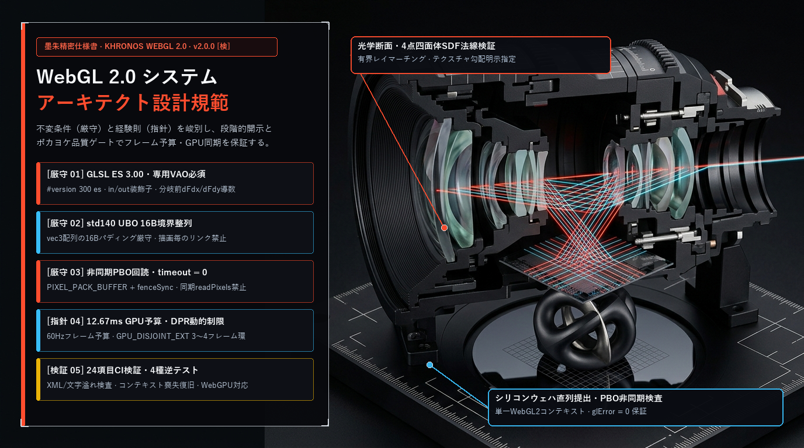
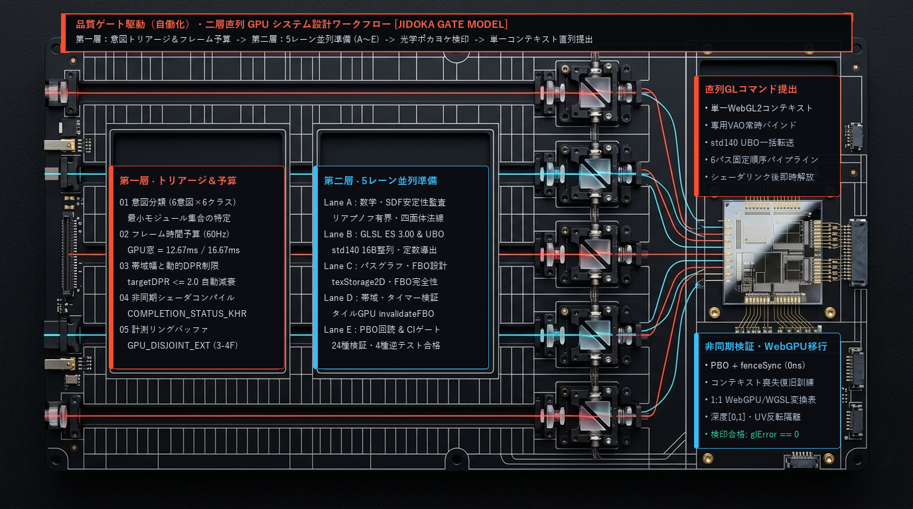
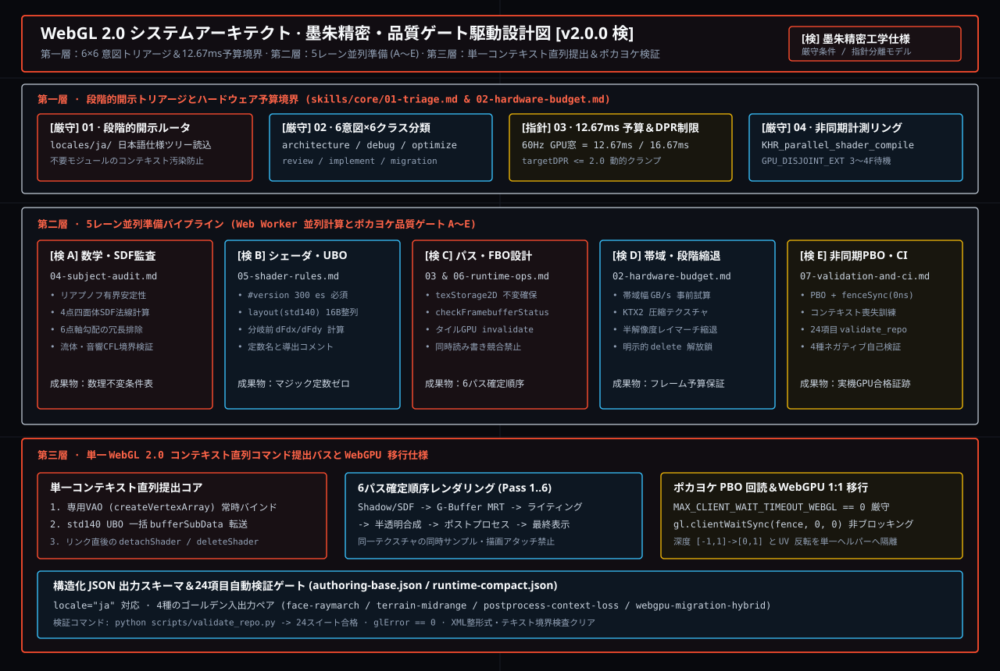
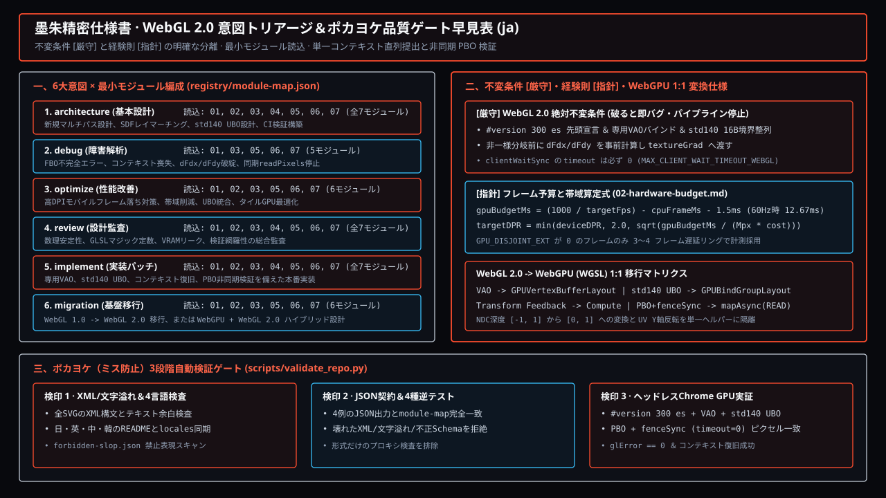

# WebGL 2.0 システムアーキテクト スキル (WebGL 2.0 Systems Architect Skill)

[English](./README.md) · [简体中文](./README.zh-CN.md) · **日本語** · [한국어](./README.ko.md)

[](https://github.com/Emily2040/webgl2-systems-architect-skill/actions/workflows/validate.yml)
[](./LICENSE)
[](./CHANGELOG.md)
[](./locales)



`webgl2-systems-architect-skill` は、**WebGL 2.0 レンダラー設計、GLSL ES 3.00 (`#version 300 es`) シェーダー規律、GPU フレームバジェット計算、非ブロッキング `PIXEL_PACK_BUFFER` (PBO) + `gl.fenceSync` パイプライン、コンテキストロスト復旧、および WebGL 2.0 から WebGPU への移行** のためのルーティング型エンジニアリングスキルです。

本パッケージは **英語 (`en`)**、**簡体字中国語 (`zh-CN`)**、**日本語 (`ja`)**、**韓国語 (`ko`)** の 4 言語それぞれに独立したビジュアルデザイン体系、固有のワークフロー設計、ローカライズされたスキルモジュール、および反スロップ（Anti-Slop）検証ルールを備えています。

- **リポジトリ**: <https://github.com/Emily2040/webgl2-systems-architect-skill>
- **インタラクティブ WebGL 2.0 ワークベンチ (`docs/index.html?lang=ja`)**: [墨朱精密・日本語モノグラフテーマを開く](./docs/index.html?lang=ja)
- **ライブ WebGL 2.0 スモークテストフィクスチャ**: [`fixtures/webgl2-smoke/index.html`](./fixtures/webgl2-smoke/index.html)
- **作成者**: **Iamemily2050** (`Emily2040`) · [Webサイト](https://Iamemily2050.com) · [X](https://x.com/iamemily2050) · [Instagram](https://instagram.com/iamemily2050)

---

## 墨朱精密 · 品質ゲート駆動（自働化）二層直列 GPU 設計ワークフロー (`ja` 固有ワークフロー設計)



日本語版は、精密光学・半導体設計仕様書の設計規律に基づき、**不変条件（`[厳守]` Invariants）** と **経験則（`[指針]` Heuristics）** を明確に分離し、各工程にポカヨケ（ミス防止）検印ゲート（`[検 A]`〜`[検 E]`）を設ける **「品質ゲート駆動・二層直列モデル (Jidoka Gate Model)」** を採用しています：

1. **第一層 · 6×6 意図トリアージとハードウェア予算境界 (`01-triage.md` & `02-hardware-budget.md`)**: ルートの [`locales/ja/SKILL.md`](./locales/ja/SKILL.md) は 800 文字未満に保たれ、6 意図 × 6 クラスから最小モジュール集合のみを選択します。60Hz での GPU 時間窓を `12.67 ms` に設定し、高 DPI モバイル端末では `targetDPR <= 2.0` クランプと 3〜4 フレーム遅延 `EXT_disjoint_timer_query_webgl2` (`GPU_DISJOINT_EXT == 0`) リングバッファを適用します。
2. **第二層 · 5 レーン並列準備とポカヨケ品質検印 (`[検 A]`〜`[検 E]`)**: Web Worker による並列準備を 5 つの独立検印レーンに分割します — **`[検 A]` 数理・4点四面体 SDF 法線監査**、**`[検 B]` `#version 300 es`・16B 境界整列 `std140` UBO・分岐前 `dFdx`/`dFdy` 事前計算**、**`[検 C]` `texStorage2D` 不変確保・タイル GPU `invalidateFramebuffer`**、**`[検 D]` 帯域幅試算と段階的縮退**、**`[検 E]` PBO + `fenceSync` 非同期検証と 24 項目 CI ゲート**。
3. **第三層 · 単一 WebGL 2.0 コンテキスト直列コマンド提出と WebGPU 1:1 移行**: 単一 `WebGL2RenderingContext` 上で専用 VAO バインド、`std140` UBO 一括転送、6 パス確定順序実行を直列に行い、`MAX_CLIENT_WAIT_TIMEOUT_WEBGL == 0` を厳守した `gl.clientWaitSync(fence, 0, 0)` ポーリングでパイプラインストールを根絶します。

---

## 墨朱精密 · ベクター設計図＆品質ゲート早見表 (`ja` SVG)





---

## 4 言語ネイティブサポート (`en`, `zh-CN`, `ja`, `ko`)

| 言語 (Locale) | ルート README | ローカライズ SKILL | ローカライズ Orchestrator | コアモジュール (`01`..`07`) |
|---|---|---|---|---|
| **English (`en`)** | [`README.md`](./README.md) | [`SKILL.md`](./SKILL.md) | [`references/00-orchestrator.md`](./references/00-orchestrator.md) | [`skills/core/`](./skills/core) |
| **简体中文 (`zh-CN`)** | [`README.zh-CN.md`](./README.zh-CN.md) | [`locales/zh-CN/SKILL.md`](./locales/zh-CN/SKILL.md) | [`locales/zh-CN/references/00-orchestrator.md`](./locales/zh-CN/references/00-orchestrator.md) | [`locales/zh-CN/skills/core/`](./locales/zh-CN/skills/core) |
| **日本語 (`ja`)** | [`README.ja.md`](./README.ja.md) | [`locales/ja/SKILL.md`](./locales/ja/SKILL.md) | [`locales/ja/references/00-orchestrator.md`](./locales/ja/references/00-orchestrator.md) | [`locales/ja/skills/core/`](./locales/ja/skills/core) |
| **한국어 (`ko`)** | [`README.ko.md`](./README.ko.md) | [`locales/ko/SKILL.md`](./locales/ko/SKILL.md) | [`locales/ko/references/00-orchestrator.md`](./locales/ko/references/00-orchestrator.md) | [`locales/ko/skills/core/`](./locales/ko/skills/core) |

[`registry/forbidden-slop.json`](./registry/forbidden-slop.json) は 4 言語すべての曖昧な宣伝文句（「圧倒的なパフォーマンス」「映画のような質感」「シームレスな体験」など）を検出し、具体的なボトルネック名、レンダーパス、数値閾値への置き換えを強制します。

---

## コアモジュールと意図別ルーティング

[`registry/module-map.json`](./registry/module-map.json) に定義された意図別のロード対象モジュール：

| 意図 (`intent`) | ロードされるモジュール | 主な成果物 |
|---|---|---|
| `architecture` | `01-triage`, `02-hardware-budget`, `03-pipeline-and-concurrency`, `04-subject-audit`, `05-shader-rules`, `06-runtime-ops`, `07-validation-and-ci` | ティア別システム設計、パスグラフ、フレームバジェット計算式、P0/P1/P2 視覚階層 |
| `implementation` | `01-triage`, `03-pipeline-and-concurrency`, `05-shader-rules`, `06-runtime-ops` | 自己完結型 `#version 300 es` シェーダー、VAO/`std140` UBO バインド、パス実装 |
| `debug` | `01-triage`, `05-shader-rules`, `06-runtime-ops`, `07-validation-and-ci` | FBO 不完全エラー、`mediump` 精度破綻、2x2 クアッド微分境界、コンテキストロストの原因特定 |
| `optimize` | `01-triage`, `02-hardware-budget`, `03-pipeline-and-concurrency`, `05-shader-rules`, `06-runtime-ops`, `07-validation-and-ci` | パス別差分計測計画、動的 `targetDPR` クランプ式、`invalidateFramebuffer`、帯域削減 |
| `review` | `01-triage`, `04-subject-audit`, `05-shader-rules`, `06-runtime-ops`, `07-validation-and-ci` | コード品質、ステート分離、P0/P1/P2 視覚説得力、本番出荷判定 |
| `migration` | `01-triage`, `03-pipeline-and-concurrency`, `05-shader-rules`, `06-runtime-ops`, `07-validation-and-ci` | WebGL 1 -> WebGL 2.0 更新、または WebGL 2.0 -> WebGPU（`GPUBindGroup`, WGSL, クリップ空間 `Z in [0, 1]`）移行計画 |

---

## 構造化出力スキーマとサンプル

- [`schemas/authoring-base.json`](./schemas/authoring-base.json) — フル設計・移行スキーマ（`skill`, `task`, `inputs`, `modules`, `assumptions`, `decisions`, `derivations`, `parallel_plan`, `deliverables`, `risks`, `validation_gates`）。
  - サンプル (`architecture` / `sdf-raymarch`): [`examples/face-raymarch.output.json`](./examples/face-raymarch.output.json)
  - サンプル (`migration` / `hybrid`): [`examples/webgpu-migration-hybrid.output.json`](./examples/webgpu-migration-hybrid.output.json)
- [`schemas/runtime-compact.json`](./schemas/runtime-compact.json) — コンパクト応答スキーマ（`intent`, `project_class`, `subject`, `locale`, `modules`, `assumptions`, `derivations`, `key_decisions`, `parallel_tasks`, `risks`, `next_steps`, `validation_gates`）。
  - サンプル (`optimize` / `raster-mesh`): [`examples/terrain-midrange.output.json`](./examples/terrain-midrange.output.json)
  - サンプル (`debug` / `postprocess`): [`examples/postprocess-context-loss.output.json`](./examples/postprocess-context-loss.output.json)

---

## インストールと検証手順

```bash
git clone https://github.com/Emily2040/webgl2-systems-architect-skill.git
cd webgl2-systems-architect-skill
python scripts/validate_repo.py
```

ローカルサーバーを起動して 4 言語対応ワークベンチ (`docs/index.html?lang=ja`) またはスモークテスト (`fixtures/webgl2-smoke/index.html`) を開くことができます：

```bash
python -m http.server 8080
```

---

## リリース＆著者情報

- **パッケージ名**: `webgl2-systems-architect-skill`
- **バージョン**: `2.0.0`
- **ライセンス**: [MIT](./LICENSE)
- **作成者**: **Iamemily2050** (`Emily2040`)
- **Git コミットメール**: `191656017+Emily2040@users.noreply.github.com`
- **リンク**: [GitHub リポジトリ](https://github.com/Emily2040/webgl2-systems-architect-skill) · [Webサイト](https://Iamemily2050.com) · [X (@iamemily2050)](https://x.com/iamemily2050) · [Instagram (@iamemily2050)](https://instagram.com/iamemily2050)
