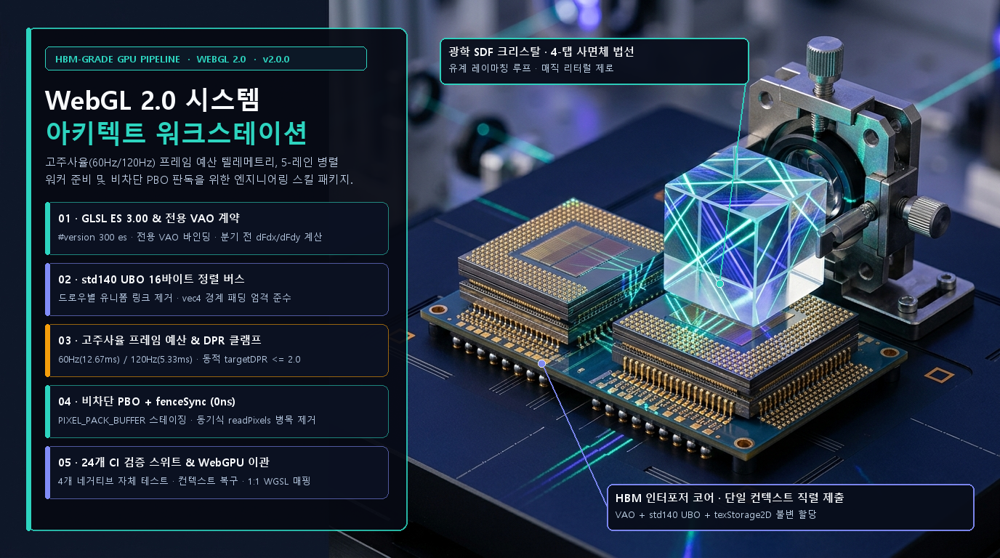
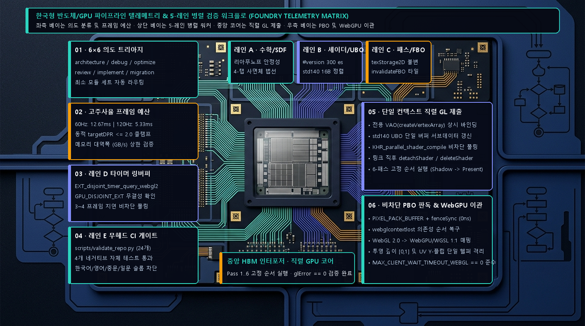
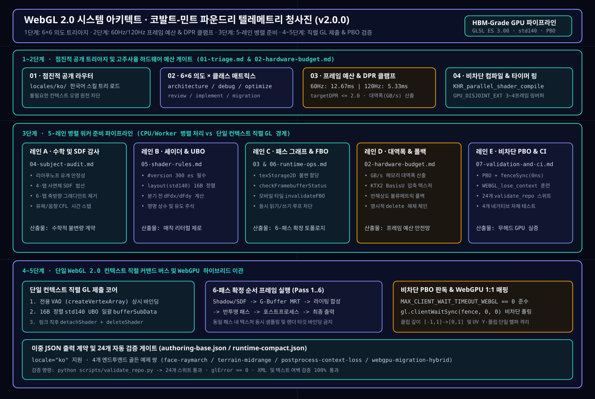
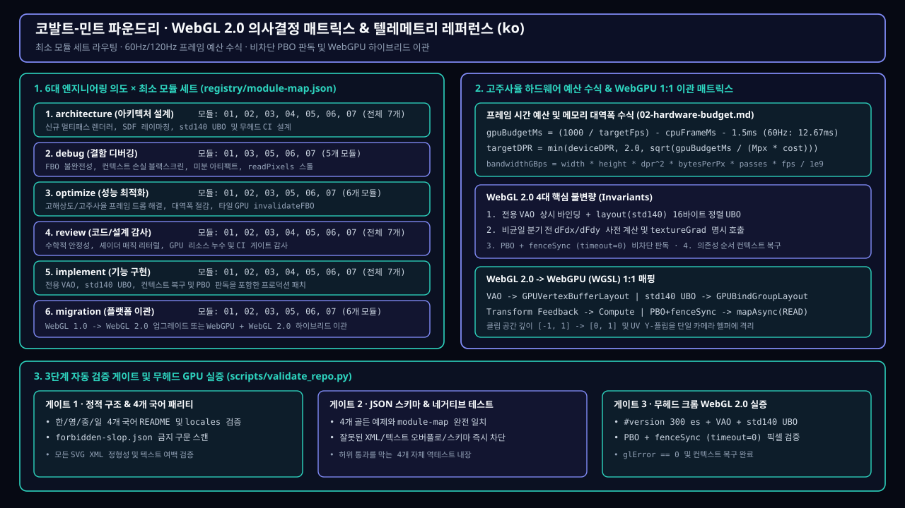

# WebGL 2.0 시스템 아키텍트 스킬 (WebGL 2.0 Systems Architect Skill)

[English](./README.md) · [简体中文](./README.zh-CN.md) · [日本語](./README.ja.md) · **한국어**

[](https://github.com/Emily2040/webgl2-systems-architect-skill/actions/workflows/validate.yml)
[](./LICENSE)
[](./CHANGELOG.md)
[](./locales)



`webgl2-systems-architect-skill`은 **WebGL 2.0 렌더러 아키텍처 설계, GLSL ES 3.00 (`#version 300 es`) 셰이더 규율, GPU 프레임 예산 수식 유도, 비차단 `PIXEL_PACK_BUFFER` (PBO) + `gl.fenceSync` 파이프라인, 컨텍스트 손실 복구 및 WebGL 2.0에서 WebGPU로의 마이그레이션**을 위한 라우팅 기반 멀티 에이전트 엔지니어링 스킬입니다.

이 패키지는 **영어 (`en`)**, **중국어 간체 (`zh-CN`)**, **일본어 (`ja`)**, **한국어 (`ko`)** 4개 언어 각각에 고유한 비주얼 디자인 시스템, 전용 엔지니어링 워크플로, 로컬라이즈된 스킬 모듈 및 안티 슬롭(Anti-Slop) 검증 규칙을 기본 제공합니다.

- **GitHub 저장소**: <https://github.com/Emily2040/webgl2-systems-architect-skill>
- **대화형 WebGL 2.0 워크벤치 (`docs/index.html?lang=ko`)**: [코발트-민트 파운드리 한국어 테마 워크벤치 열기](./docs/index.html?lang=ko)
- **실시간 WebGL 2.0 스모크 테스트 픽스처**: [`fixtures/webgl2-smoke/index.html`](./fixtures/webgl2-smoke/index.html)
- **작성자**: **Iamemily2050** (`Emily2040`) · [웹사이트](https://Iamemily2050.com) · [X](https://x.com/iamemily2050) · [Instagram](https://instagram.com/iamemily2050)

---

## 코발트-민트 파운드리 · 고주사율 텔레메트리 & 5-레인 병렬 검증 워크플로 (`ko` 전용 워크플로 설계)



한국어 에디션은 고주사율(60Hz/120Hz) 및 고밀도 디스플레이 환경과 HBM급 메모리 대역폭 버짓팅에 최적화된 **“파운드리 텔레메트리 & 5-레인 병렬 검증 매트릭스 (Foundry Telemetry Matrix)”** 아키텍처를 채택합니다:

1. **1~2단계 · 6×6 의도 트리아지 및 고주사율 프레임 예산 게이트 (`01-triage.md` & `02-hardware-budget.md`)**: 루트 [`locales/ko/SKILL.md`](./locales/ko/SKILL.md)는 800자 미만으로 유지되며 6대 의도 × 6대 프로젝트 분류에서 최소 모듈 세트만 로드합니다. 60Hz(`12.67 ms`) 및 120Hz(`5.33 ms`) GPU 시간 예산을 산출하고, 고해상도 패널에서 `targetDPR <= 2.0` 동적 클램프와 메모리 대역폭(`GB/s`) 상한을 검증합니다.
2. **3단계 · 5-레인 병렬 워커 준비 파이프라인 (`레인 A`..`레인 E`)**: CPU 및 Web Worker에서 **레인 A(리아푸노프 안정성 및 4-탭 사면체 SDF 법선)**, **레인 B(`#version 300 es` 및 16바이트 정렬 `std140` UBO)**, **레인 C(`texStorage2D` 불변 할당 및 모바일 타일 GPU `invalidateFramebuffer`)**, **레인 D(`EXT_disjoint_timer_query_webgl2` 3~4 프레임 링버퍼)**, **레인 E(비차단 PBO 및 24개 CI 게이트)**를 병렬로 준비합니다.
3. **4~5단계 · 단일 컨텍스트 직렬 GL 제출 및 WebGPU 하이브리드 이관**: 단일 `WebGL2RenderingContext`에서 전용 VAO 바인딩, `std140` UBO 일괄 갱신, 6-패스 확정 순서 실행을 직렬로 수행하며, `gl.PIXEL_PACK_BUFFER` + `gl.fenceSync` (`timeout = 0`) 비차단 판독과 WebGL 2.0 -> WebGPU(`WGSL`) 1:1 매핑을 보장합니다.

---

## 코발트-민트 파운드리 · 벡터 아키텍처 청사진 & 의사결정 매트릭스 (`ko` SVG)





---

## 4개 언어 네이티브 지원 (`en`, `zh-CN`, `ja`, `ko`)

| 언어 (Locale) | 루트 README | 로컬라이즈 SKILL | 로컬라이즈 Orchestrator | 코어 모듈 (`01`..`07`) |
|---|---|---|---|---|
| **English (`en`)** | [`README.md`](./README.md) | [`SKILL.md`](./SKILL.md) | [`references/00-orchestrator.md`](./references/00-orchestrator.md) | [`skills/core/`](./skills/core) |
| **简体中文 (`zh-CN`)** | [`README.zh-CN.md`](./README.zh-CN.md) | [`locales/zh-CN/SKILL.md`](./locales/zh-CN/SKILL.md) | [`locales/zh-CN/references/00-orchestrator.md`](./locales/zh-CN/references/00-orchestrator.md) | [`locales/zh-CN/skills/core/`](./locales/zh-CN/skills/core) |
| **日本語 (`ja`)** | [`README.ja.md`](./README.ja.md) | [`locales/ja/SKILL.md`](./locales/ja/SKILL.md) | [`locales/ja/references/00-orchestrator.md`](./locales/ja/references/00-orchestrator.md) | [`locales/ja/skills/core/`](./locales/ja/skills/core) |
| **한국어 (`ko`)** | [`README.ko.md`](./README.ko.md) | [`locales/ko/SKILL.md`](./locales/ko/SKILL.md) | [`locales/ko/references/00-orchestrator.md`](./locales/ko/references/00-orchestrator.md) | [`locales/ko/skills/core/`](./locales/ko/skills/core) |

[`registry/forbidden-slop.json`](./registry/forbidden-slop.json)은 4개 언어 모두에서 "압도적인 퀄리티", "극한의 성능", "시네마틱한 느낌" 같은 모호한 과장 표현을 차단하고 구체적인 병목 원인, 렌더 패스 이름, 수치 임계값으로 대체하도록 강제합니다.

---

## 코어 모듈 및 의도별 라우팅 매트릭스

[`registry/module-map.json`](./registry/module-map.json)에 정의된 작업 의도별 로드 모듈:

| 작업 의도 (`intent`) | 로드되는 모듈 | 주요 산출물 |
|---|---|---|
| `architecture` | `01-triage`, `02-hardware-budget`, `03-pipeline-and-concurrency`, `04-subject-audit`, `05-shader-rules`, `06-runtime-ops`, `07-validation-and-ci` | 티어별 시스템 아키텍처, 패스 그래프, 프레임 예산 수식, P0/P1/P2 시각 계층 |
| `implementation` | `01-triage`, `03-pipeline-and-concurrency`, `05-shader-rules`, `06-runtime-ops` | 자기 완결형 `#version 300 es` 셰이더, VAO/`std140` UBO 바인딩, 패스 구현 코드 |
| `debug` | `01-triage`, `05-shader-rules`, `06-runtime-ops`, `07-validation-and-ci` | FBO 불완전 오류, `mediump` 정밀도 깨짐, 2x2 쿼드 미분 경계, 컨텍스트 손실 원인 격리 |
| `optimize` | `01-triage`, `02-hardware-budget`, `03-pipeline-and-concurrency`, `05-shader-rules`, `06-runtime-ops`, `07-validation-and-ci` | 패스별 차등 타이밍 측정 계획, 동적 `targetDPR` 클램프 수식, `invalidateFramebuffer`, 대역폭 절감 |
| `review` | `01-triage`, `04-subject-audit`, `05-shader-rules`, `06-runtime-ops`, `07-validation-and-ci` | 코드 품질, 상태 격리, P0/P1/P2 시각적 설득력 및 배포 준비 감사 |
| `migration` | `01-triage`, `03-pipeline-and-concurrency`, `05-shader-rules`, `06-runtime-ops`, `07-validation-and-ci` | WebGL 1 -> WebGL 2.0 업그레이드 또는 WebGL 2.0 -> WebGPU(`GPUBindGroup`, WGSL, 클립 공간 `Z in [0, 1]`) 전환 청사진 |

---

## 구조화된 출력 스키마 및 예제

- [`schemas/authoring-base.json`](./schemas/authoring-base.json) — 전체 아키텍처 및 마이그레이션 스키마 (`skill`, `task`, `inputs`, `modules`, `assumptions`, `decisions`, `derivations`, `parallel_plan`, `deliverables`, `risks`, `validation_gates`).
  - 예제 (`architecture` / `sdf-raymarch`): [`examples/face-raymarch.output.json`](./examples/face-raymarch.output.json)
  - 예제 (`migration` / `hybrid`): [`examples/webgpu-migration-hybrid.output.json`](./examples/webgpu-migration-hybrid.output.json)
- [`schemas/runtime-compact.json`](./schemas/runtime-compact.json) — 컴팩트 응답 스키마 (`intent`, `project_class`, `subject`, `locale`, `modules`, `assumptions`, `derivations`, `key_decisions`, `parallel_tasks`, `risks`, `next_steps`, `validation_gates`).
  - 예제 (`optimize` / `raster-mesh`): [`examples/terrain-midrange.output.json`](./examples/terrain-midrange.output.json)
  - 예제 (`debug` / `postprocess`): [`examples/postprocess-context-loss.output.json`](./examples/postprocess-context-loss.output.json)

---

## 설치 및 검증 방법

```bash
git clone https://github.com/Emily2040/webgl2-systems-architect-skill.git
cd webgl2-systems-architect-skill
python scripts/validate_repo.py
```

정적 서버를 실행하여 4개 언어 대화형 워크벤치(`docs/index.html?lang=ko`) 또는 스모크 테스트(`fixtures/webgl2-smoke/index.html`)를 브라우저에서 확인할 수 있습니다:

```bash
python -m http.server 8080
```

---

## 릴리스 및 작성자 정보

- **패키지 이름**: `webgl2-systems-architect-skill`
- **버전**: `2.0.0`
- **라이선스**: [MIT](./LICENSE)
- **작성자**: **Iamemily2050** (`Emily2040`)
- **Git 커밋 이메일**: `191656017+Emily2040@users.noreply.github.com`
- **링크**: [GitHub 저장소](https://github.com/Emily2040/webgl2-systems-architect-skill) · [웹사이트](https://Iamemily2050.com) · [X (@iamemily2050)](https://x.com/iamemily2050) · [Instagram (@iamemily2050)](https://instagram.com/iamemily2050)
