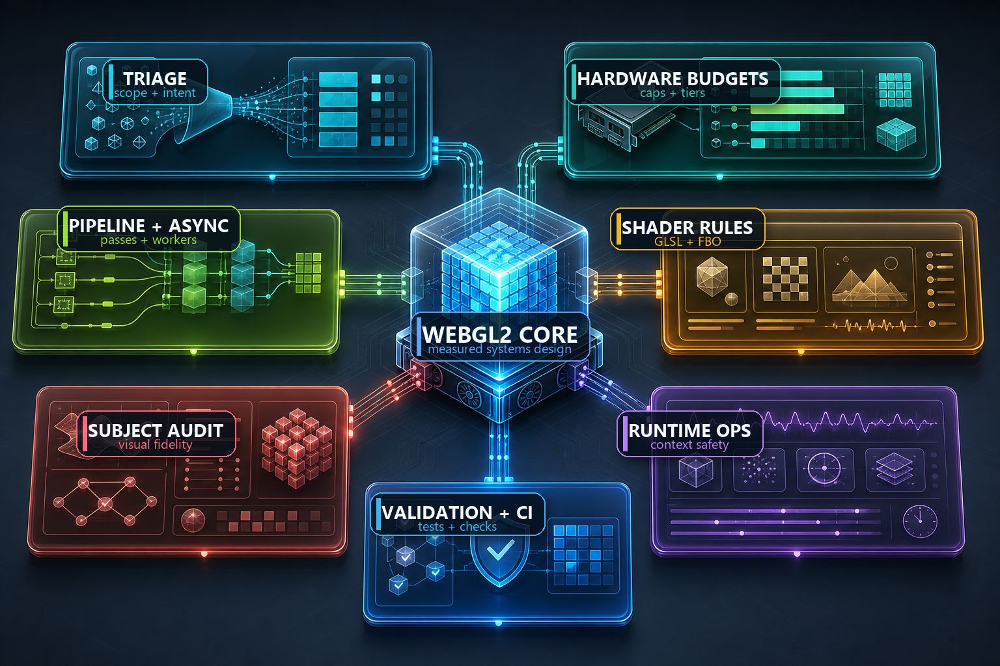

<p align="center">
  
</p>

<h1 align="center">WebGL 2 Systems Architect Skill</h1>

<p align="center">
  <strong>A modular agent skill for renderer architecture, shader review, GPU profiling, context safety, and visual validation.</strong>
</p>

<p align="center">
  <a href="https://github.com/Emily2040/webgl2-systems-architect-skill/actions/workflows/validate.yml"></a>
  
  
  
</p>

<p align="center">
  <a href="https://github.com/Emily2040/webgl2-systems-architect-skill">Repository</a>
  |
  <a href="#capability-map">Capability Map</a>
  |
  <a href="#installation">Installation</a>
  |
  <a href="#validation">Validation</a>
</p>

## Capability Map

<p align="center">
  
</p>

| Lane | Color | What it protects |
| --- | --- | --- |
| Triage |  | Turns ambiguous WebGL requests into a concrete task record. |
| Hardware Budgets |  | Keeps DPR, fill-rate, memory, and GPU limits honest. |
| Pipeline + Async |  | Separates real parallel work from work that is serial on one WebGL context. |
| Shader Rules |  | Reviews shader math, precision, postprocess passes, and framebuffer choices. |
| Subject Audit |  | Checks whether the rendered subject actually matches the visual goal. |
| Runtime Ops |  | Handles context loss, extensions, browser behavior, and production hardening. |
| Validation + CI |  | Connects advice to smoke tests, visual checks, and repository validation. |

## What this is for

Use this skill when a user needs help with:

- WebGL 2.0 renderer architecture
- shader engineering and SDF math
- performance budgets and tiering
- runtime orchestration and context safety
- visual subject audits
- validation, CI, and production hardening

This is not a monolithic handbook stuffed into one prompt. The root `SKILL.md` is a router. The orchestrator loads only the modules relevant to the current task.

Implicit invocation should trigger on WebGL2 renderer architecture, GLSL shader review, GPU profiling, FBO or postprocess pipeline design, context-loss debugging, DPR/fill-rate optimization, visual regression, and migration planning.

## Design goals

- keep the root skill tiny
- separate invariants from heuristics
- favor measurements over lore
- model parallel and async work honestly
- produce outputs that are usable by both humans and downstream systems

## Architecture


A browser-friendly overview also lives at [`docs/index.html`](docs/index.html).

## Repository map

```text
SKILL.md
AGENTS.md / CLAUDE.md / GEMINI.md
LICENSE
CHANGELOG.md / CONTRIBUTING.md / SECURITY.md
.gitignore
agents/
  openai.yaml
docs/
  index.html
  assets/
    architecture.svg
    skill-infographic.svg
    webgl2-systems-hero.png
    webgl2-systems-infographic.png
references/
  00-orchestrator.md
  01-redesign-rationale.md
  02-webgl2-source-table.md
skills/core/
  01-triage.md
  02-hardware-budget.md
  03-pipeline-and-concurrency.md
  04-subject-audit.md
  05-shader-rules.md
  06-runtime-ops.md
  07-validation-and-ci.md
registry/
  forbidden-slop.json
  module-map.json
schemas/
  authoring-base.json
  runtime-compact.json
examples/
  *.input.md
  *.output.json
fixtures/
  webgl2-smoke/
scripts/
  validate_repo.py
.github/
  ISSUE_TEMPLATE/
  PULL_REQUEST_TEMPLATE.md
  workflows/
    validate.yml
```

## How it works

1. `SKILL.md` routes to the orchestrator.
2. The orchestrator builds a task record and selects modules.
3. Independent lanes can run in parallel:
   - hardware and caps
   - subject audit
   - pipeline and async design
   - shader/runtime review
   - validation
4. The answer is synthesized into prose or JSON.

## Parallel and async stance

This skill distinguishes between:

- truly parallel or asynchronous work
- pipelined work
- work that is still serial on a single WebGL context

That means the skill will recommend `Promise.all`, workers, `OffscreenCanvas`, or `KHR_parallel_shader_compile` only when they remove actual waiting, not because "async" sounds fashionable.

## Installation

### AGENTS-style loaders

```bash
mkdir -p .agents/skills
cp -R webgl2-systems-architect-skill .agents/skills/webgl2-systems-architect-skill
```

Load `SKILL.md` from the copied folder.

The installed folder name should match the skill name in `SKILL.md`: `webgl2-systems-architect-skill`.

### Wrapper-friendly loaders

If a host prefers alternate entry points, load one of:

- `AGENTS.md`
- `CLAUDE.md`
- `GEMINI.md`

Each wrapper points back to the canonical root skill so logic does not drift.

## Output contracts

When structured output is requested, use:

- `schemas/authoring-base.json` for full authoring output
- `schemas/runtime-compact.json` for compact handoff or runtime use

Examples live in the `examples/` directory.

## Source grounding and testing

The WebGL2 guidance is grounded in the reference matrix at [`references/02-webgl2-source-table.md`](references/02-webgl2-source-table.md). That file links the core modules to MDN WebGL best practices, the Khronos WebGL 2.0 specification, the WebGL extension registry, context-loss guidance, and browser/visual testing references.

The repo includes a small browser fixture at [`fixtures/webgl2-smoke/index.html`](fixtures/webgl2-smoke/index.html). It creates a WebGL2 context, compiles and links one shader pair, draws a triangle, exposes a smoke-test result on `window.__webgl2Smoke`, and gives future Playwright checks a concrete target.

## Validation

Run the validator:

```bash
python scripts/validate_repo.py
```

The GitHub Actions workflow runs the same check on pull requests across Ubuntu and Windows.

## Release policy

Keep `SKILL.md` metadata, README badges, examples, changelog entries, and GitHub tags synchronized. Use semantic versioning:

- patch: wording, docs, validation, or compatible examples
- minor: new modules, fields, or behavior that remains backward compatible
- major: output schema or routing changes that can break existing consumers

## Notes on the redesign

This skill intentionally converts several blanket rules from the source doctrine into measured policies. Examples include:

- context attributes
- DPR caps
- workerization
- reversed-Z usage
- theoretical throughput math

Those are important ideas, but they are not universal constants. The skill treats them as conditional decisions backed by project class, capability detection, and measurements.

## Author

Created by **Iamemily2050**.

- GitHub: [Emily2040](https://github.com/Emily2040)
- Website: [Iamemily2050.com](https://Iamemily2050.com)
- X: [@iamemily2050](https://x.com/iamemily2050)
- Instagram: [@iamemily2050](https://instagram.com/iamemily2050)
