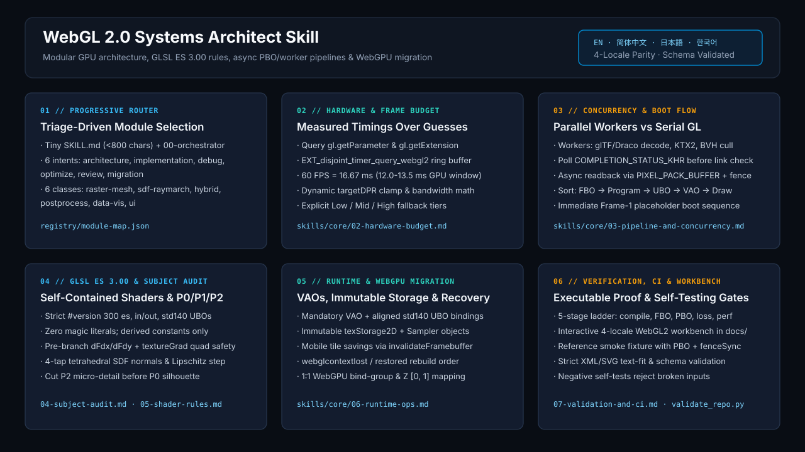
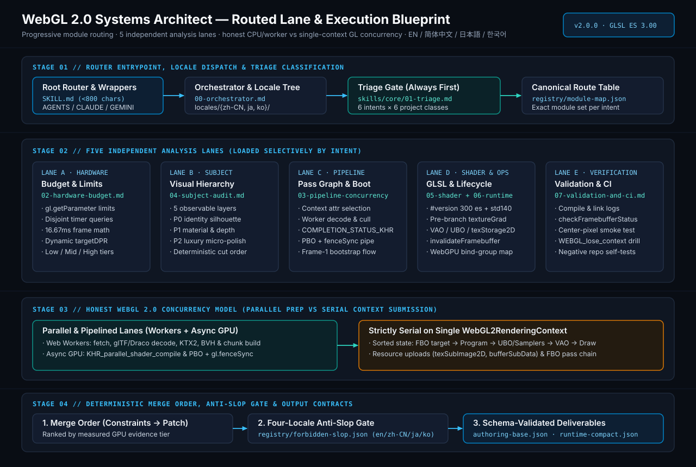

# WebGL 2.0 Systems Architect Skill

**English** · [简体中文](./README.zh-CN.md) · [日本語](./README.ja.md) · [한국어](./README.ko.md)

[](https://github.com/Emily2040/webgl2-systems-architect-skill/actions/workflows/validate.yml)
[](./LICENSE)
[](./CHANGELOG.md)
[](./locales)



`webgl2-systems-architect-skill` is a routed, multi-agent-ready engineering skill for **WebGL 2.0 renderer architecture, GLSL ES 3.00 (`#version 300 es`) shader discipline, GPU frame-budget derivation, non-blocking `PIXEL_PACK_BUFFER` + `gl.fenceSync` pipelines, context-loss recovery, and WebGL 2.0 to WebGPU migration**.

The package ships with native documentation, localized skill modules, and anti-slop rules across four languages: **English (`en`)**, **Simplified Chinese (`zh-CN`)**, **Japanese (`ja`)**, and **Korean (`ko`)**.

- **Repository**: <https://github.com/Emily2040/webgl2-systems-architect-skill>
- **Interactive Workbench (`docs/index.html`)**: [Open local workbench](./docs/index.html)
- **Live WebGL 2.0 Smoke Fixture**: [`fixtures/webgl2-smoke/index.html`](./fixtures/webgl2-smoke/index.html)
- **Author**: Created by **Iamemily2050** (`Emily2040`) · [Website](https://Iamemily2050.com) · [X](https://x.com/iamemily2050) · [Instagram](https://instagram.com/iamemily2050)

---

## Why This Skill Exists

Monolithic graphics prompts waste context tokens. Most graphics prompts dump an entire textbook into the context window, mixing incompatible rules (such as forcing SDF raymarching rules onto an instanced raster mesh pipeline) and encouraging vague advice.

This repository treats WebGL 2.0 systems engineering as a routed workflow.

1. **Tiny router entrypoint**: [`SKILL.md`](./SKILL.md) stays under 800 characters and routes straight to [`references/00-orchestrator.md`](./references/00-orchestrator.md).
2. **Triage-first module selection**: [`skills/core/01-triage.md`](./skills/core/01-triage.md) classifies the task across 6 intents (`architecture`, `implementation`, `debug`, `optimize`, `review`, `migration`) and 6 project classes (`raster-mesh`, `sdf-raymarch`, `hybrid`, `postprocess`, `data-vis`, `ui`), loading only the modules mapped in [`registry/module-map.json`](./registry/module-map.json).
3. **Invariants separated from heuristics**: Invariants (no free shader variables, explicit assumptions, derived numeric constants, bound VAOs, verified FBO completeness) always hold. Heuristics (`alpha: false`, reversed-Z, deferred vs forward, DPR caps, raymarch tap counts) depend on measured device budgets.
4. **Honest WebGL 2.0 concurrency**: Web Workers parallelize asset fetch, glTF/Draco decoding, KTX2 transcoding, and culling; `KHR_parallel_shader_compile` and `gl.PIXEL_PACK_BUFFER` + `gl.fenceSync` pipeline GPU status across frames; single-context WebGL 2.0 draw submission remains strictly serial.
5. **Executable verification gates**: [`scripts/validate_repo.py`](./scripts/validate_repo.py) checks JSON schemas, exact module-set equality, strict XML/SVG text-fit margins, four-language parity, forbidden-slop enforcement, and negative self-tests.

---

## Architecture Blueprint



---

## Four-Language Support (`en`, `zh-CN`, `ja`, `ko`)

Engineers and coding agents can run the skill natively in four locales:

| Locale | Root README | Localized Skill Router | Localized Orchestrator | Core Modules (`01`..`07`) |
|---|---|---|---|---|
| **English (`en`)** | [`README.md`](./README.md) | [`SKILL.md`](./SKILL.md) | [`references/00-orchestrator.md`](./references/00-orchestrator.md) | [`skills/core/`](./skills/core) |
| **Simplified Chinese (`zh-CN`)** | [`README.zh-CN.md`](./README.zh-CN.md) | [`locales/zh-CN/SKILL.md`](./locales/zh-CN/SKILL.md) | [`locales/zh-CN/references/00-orchestrator.md`](./locales/zh-CN/references/00-orchestrator.md) | [`locales/zh-CN/skills/core/`](./locales/zh-CN/skills/core) |
| **Japanese (`ja`)** | [`README.ja.md`](./README.ja.md) | [`locales/ja/SKILL.md`](./locales/ja/SKILL.md) | [`locales/ja/references/00-orchestrator.md`](./locales/ja/references/00-orchestrator.md) | [`locales/ja/skills/core/`](./locales/ja/skills/core) |
| **Korean (`ko`)** | [`README.ko.md`](./README.ko.md) | [`locales/ko/SKILL.md`](./locales/ko/SKILL.md) | [`locales/ko/references/00-orchestrator.md`](./locales/ko/references/00-orchestrator.md) | [`locales/ko/skills/core/`](./locales/ko/skills/core) |

[`registry/forbidden-slop.json`](./registry/forbidden-slop.json) enforces locale-specific anti-slop rules across all four languages, replacing generic hype phrases with concrete bottleneck names, pass identifiers, and frame-time numbers.

---

## Core Modules & Intent Routing

[`registry/module-map.json`](./registry/module-map.json) defines the exact module set loaded for each task intent:

| Intent | Loaded Modules | Primary Deliverable |
|---|---|---|
| `architecture` | `01-triage`, `02-hardware-budget`, `03-pipeline-and-concurrency`, `04-subject-audit`, `05-shader-rules`, `06-runtime-ops`, `07-validation-and-ci` | Tiered system architecture, pass graph, frame-budget math, and P0/P1/P2 visual hierarchy |
| `implementation` | `01-triage`, `03-pipeline-and-concurrency`, `05-shader-rules`, `06-runtime-ops` | Self-contained `#version 300 es` shaders, VAO/std140 UBO bindings, and pass code |
| `debug` | `01-triage`, `05-shader-rules`, `06-runtime-ops`, `07-validation-and-ci` | Root-cause isolation for FBO completeness, `mediump` overflow, quad derivative seams, or context loss |
| `optimize` | `01-triage`, `02-hardware-budget`, `03-pipeline-and-concurrency`, `05-shader-rules`, `06-runtime-ops`, `07-validation-and-ci` | Differential pass timing plan, dynamic `targetDPR` clamp formula, `invalidateFramebuffer`, and bandwidth reduction |
| `review` | `01-triage`, `04-subject-audit`, `05-shader-rules`, `06-runtime-ops`, `07-validation-and-ci` | Code, state-isolation, visual hierarchy, and ship-readiness audit |
| `migration` | `01-triage`, `03-pipeline-and-concurrency`, `05-shader-rules`, `06-runtime-ops`, `07-validation-and-ci` | WebGL 1 to WebGL 2.0 upgrade or WebGL 2.0 to WebGPU (`GPUBindGroup`, WGSL, clip-space `Z in [0, 1]`) blueprint |

---

## Structured Output Contracts & Examples

Downstream tools and CI pipelines can request validated JSON output matching either schema:

- [`schemas/authoring-base.json`](./schemas/authoring-base.json) defines the full architectural and migration contract (`skill`, `task`, `inputs`, `modules`, `assumptions`, `decisions`, `derivations`, `parallel_plan`, `deliverables`, `risks`, `validation_gates`).
  - Example (`architecture` / `sdf-raymarch`): [`examples/face-raymarch.output.json`](./examples/face-raymarch.output.json)
  - Example (`migration` / `hybrid`): [`examples/webgpu-migration-hybrid.output.json`](./examples/webgpu-migration-hybrid.output.json)
- [`schemas/runtime-compact.json`](./schemas/runtime-compact.json) defines the compact engineering response (`intent`, `project_class`, `subject`, `locale`, `modules`, `assumptions`, `derivations`, `key_decisions`, `parallel_tasks`, `risks`, `next_steps`, `validation_gates`).
  - Example (`optimize` / `raster-mesh`): [`examples/terrain-midrange.output.json`](./examples/terrain-midrange.output.json)
  - Example (`debug` / `postprocess`): [`examples/postprocess-context-loss.output.json`](./examples/postprocess-context-loss.output.json)

---

## Repository Structure

```text
webgl2-systems-architect-skill/
├── SKILL.md                              # Compact router entrypoint (< 800 chars)
├── AGENTS.md / CLAUDE.md / GEMINI.md     # Cross-agent startup instructions
├── README.md / README.zh-CN.md / README.ja.md / README.ko.md
├── agents/openai.yaml                    # OpenAI / Codex agent interface metadata
├── references/
│   ├── 00-orchestrator.md                # Lane orchestration, merge order & output rules
│   ├── 01-redesign-rationale.md          # Architectural decisions & invariants
│   └── 02-webgl2-source-table.md         # Khronos/MDN/WebGPU anchors & 7 compatibility gates
├── skills/core/
│   ├── 01-triage.md                      # 6 intents × 6 project classes classification
│   ├── 02-hardware-budget.md             # gl.getParameter limits, disjoint timers & DPR math
│   ├── 03-pipeline-and-concurrency.md    # Worker prep, KHR_parallel_shader_compile & PBOs
│   ├── 04-subject-audit.md               # 5 observable layers & P0/P1/P2 cut order
│   ├── 05-shader-rules.md                # GLSL ES 3.00, std140 UBOs, derivatives & precision
│   ├── 06-runtime-ops.md                 # VAOs, texStorage2D, context loss & WebGPU map
│   └── 07-validation-and-ci.md           # 5-stage verification ladder & CI gates
├── locales/{zh-CN,ja,ko}/                # Native CJK skill routers, orchestrators & core modules
├── registry/
│   ├── module-map.json                   # Canonical intent -> module list
│   └── forbidden-slop.json               # 4-locale banned phrases & evidence replacements
├── schemas/
│   ├── authoring-base.json               # Full structured output JSON Schema
│   └── runtime-compact.json              # Compact runtime JSON Schema
├── examples/                             # 4 schema-validated output examples across intents
├── fixtures/webgl2-smoke/index.html      # Live WebGL2 VAO + std140 UBO + PBO/fenceSync fixture
├── docs/
│   ├── index.html                        # Interactive 4-language WebGL2 Workbench
│   └── assets/                           # Validated SVG & PNG technical blueprints
└── scripts/validate_repo.py              # Zero-dependency validator with negative self-tests
```

---

## Installation & Usage

### 1. Codex / Claude Code / Gemini / Antigravity Skill

Clone the repository into your skills directory:

```bash
git clone https://github.com/Emily2040/webgl2-systems-architect-skill.git
```

Invoke `$webgl2-systems-architect-skill` or point your agent to [`SKILL.md`](./SKILL.md) (or `locales/{zh-CN,ja,ko}/SKILL.md` for Simplified Chinese, Japanese, or Korean sessions).

### 2. Run the Validator & Negative Self-Tests

The validator uses only the Python 3 standard library:

```bash
python scripts/validate_repo.py
```

### 3. Open the Interactive Workbench or Smoke Fixture

Serve the repository root with any static HTTP server and open `/docs/index.html` or `/fixtures/webgl2-smoke/index.html`:

```bash
python -m http.server 8080
```

---

## Release & Identity Metadata

- **Package Name**: `webgl2-systems-architect-skill`
- **Version**: `2.0.0`
- **License**: [MIT](./LICENSE)
- **Author**: **Iamemily2050** (`Emily2040`)
- **Git Commit Identity**: `191656017+Emily2040@users.noreply.github.com`
- **Links**: [GitHub Repository](https://github.com/Emily2040/webgl2-systems-architect-skill) · [Website](https://Iamemily2050.com) · [X (@iamemily2050)](https://x.com/iamemily2050) · [Instagram (@iamemily2050)](https://instagram.com/iamemily2050)
