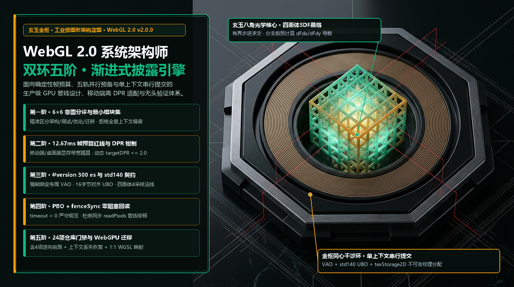
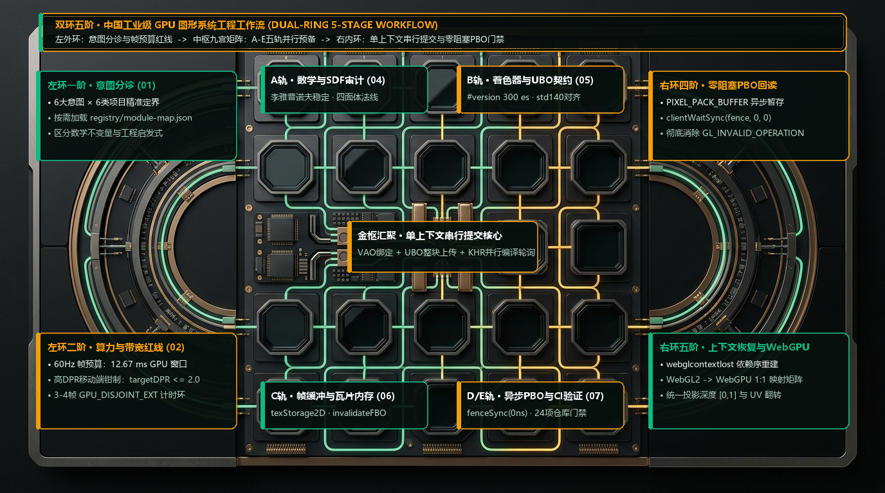
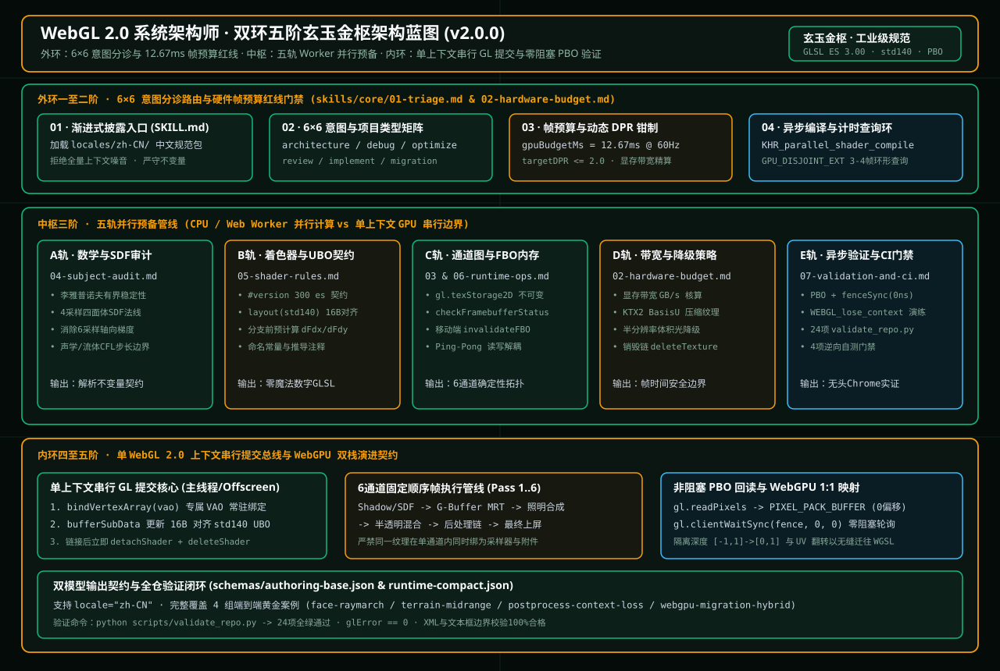
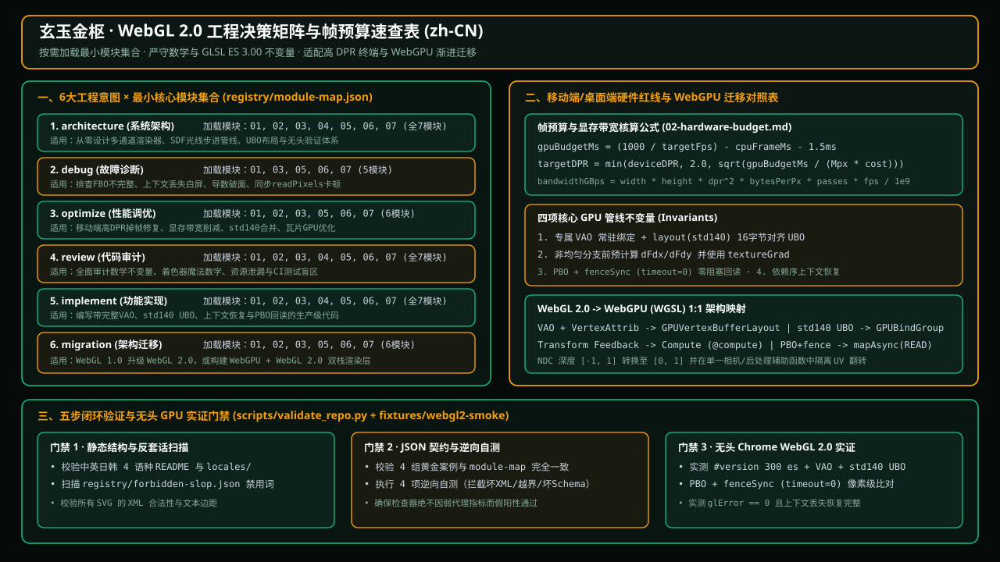

# WebGL 2.0 系统架构师技能包 (WebGL 2.0 Systems Architect Skill)

[English](./README.md) · **简体中文** · [日本語](./README.ja.md) · [한국어](./README.ko.md)

[](https://github.com/Emily2040/webgl2-systems-architect-skill/actions/workflows/validate.yml)
[](./LICENSE)
[](./CHANGELOG.md)
[](./locales)



`webgl2-systems-architect-skill` 是一个支持多智能体并行分流的 **WebGL 2.0 渲染器架构、GLSL ES 3.00 (`#version 300 es`) 着色器规范、GPU 帧预算推导、非阻塞 `PIXEL_PACK_BUFFER` (PBO) + `gl.fenceSync` 回读管线、上下文丢失恢复与 WebGL 2.0 到 WebGPU 迁移** 工程技能包。

本仓库内置 **英文 (`en`)**、**简体中文 (`zh-CN`)**、**日文 (`ja`)** 与 **韩文 (`ko`)** 四套独立的视觉设计系统、专属工作流模型、本地化技能模块与反套话（Anti-Slop）校验规则。

- **GitHub 仓库**: <https://github.com/Emily2040/webgl2-systems-architect-skill>
- **交互式 WebGL 2.0 工程工作台 (`docs/index.html?lang=zh-CN`)**: [打开玄玉金枢中文主题工作台](./docs/index.html?lang=zh-CN)
- **实时 WebGL 2.0 冒烟测试夹具**: [`fixtures/webgl2-smoke/index.html`](./fixtures/webgl2-smoke/index.html)
- **作者**: **Iamemily2050** (`Emily2040`) · [个人网站](https://Iamemily2050.com) · [X](https://x.com/iamemily2050) · [Instagram](https://instagram.com/iamemily2050)

---

## 玄玉金枢 · 双环五阶中国工业级图形工程工作流 (`zh-CN` 专属工作流设计)



针对国内高分屏移动终端（高 DPR OLED 屏幕）、跨端 WebView 容器与桌面级科学可视化场景，中文版采用 **“双环五阶·玄玉金枢” (Dual-Ring 5-Stage Progressive Workflow)** 架构：

1. **左外环一阶 · 6×6 意图分诊与最小模块集 (`01-triage.md`)**：根目录 [`locales/zh-CN/SKILL.md`](./locales/zh-CN/SKILL.md) 保持在 800 字符以内，按 6 类任务意图（`architecture`, `implementation`, `debug`, `optimize`, `review`, `migration`）与 6 类项目类型精准加载 [`registry/module-map.json`](./registry/module-map.json) 中的最小模块集合。
2. **左外环二阶 · 12.67ms 算力与高 DPR 带宽红线 (`02-hardware-budget.md`)**：在 60Hz 下锁定 `12.67 ms` GPU 帧预算窗口，针对移动端 3x DPR 屏幕强制执行 `targetDPR <= 2.0` 动态钳制与显存带宽核算，并通过 3–4 帧 `EXT_disjoint_timer_query_webgl2` (`GPU_DISJOINT_EXT == 0`) 环形缓冲区采集真实 GPU 耗时。
3. **中枢三阶 · 九宫五轨 Worker 并行预备 (`A`..`E` 轨)**：在 CPU / Web Worker 上并行推进 **A轨（李雅普诺夫稳定与四面体 4 采样 SDF 法线）**、**B轨（`#version 300 es` 与 16 字节对齐 `std140` UBO）**、**C轨（`texStorage2D` 不可变纹理与瓦片 GPU `invalidateFramebuffer`）**、**D轨（带宽预算与分级降级）** 与 **E轨（无头验证与 CI 门禁）**。
4. **右内环四阶 · 单上下文串行 GL 提交与零阻塞 PBO 回读 (`03/06/07`)**：所有状态切换与绘制命令在单一 `WebGL2RenderingContext` 上按固定 6 通道顺序串行提交；像素校验一律通过 `gl.PIXEL_PACK_BUFFER` + `gl.fenceSync` (`gl.clientWaitSync(fence, 0, 0)`) 非阻塞完成。
5. **右内环五阶 · 依赖序上下文恢复与 WebGPU 1:1 双栈迁移**：支持 `webglcontextlost` / `webglcontextrestored` 按“缓冲 -> 纹理 -> 着色器 -> UBO -> VAO -> FBO”依赖序重建，并提供向 WebGPU (`WGSL`) 的 1:1 映射。

---

## 玄玉金枢 · 矢量架构蓝图与工程决策矩阵 (`zh-CN` SVG)





---

## 原生四语言支持 (`en`, `zh-CN`, `ja`, `ko`)

工程师与编程智能体可在四种语言环境下原生运行本技能：

| 语言 (Locale) | 根目录文档 | 本地化技能入口 | 本地化总控编排器 | 核心模块 (`01`..`07`) |
|---|---|---|---|---|
| **English (`en`)** | [`README.md`](./README.md) | [`SKILL.md`](./SKILL.md) | [`references/00-orchestrator.md`](./references/00-orchestrator.md) | [`skills/core/`](./skills/core) |
| **简体中文 (`zh-CN`)** | [`README.zh-CN.md`](./README.zh-CN.md) | [`locales/zh-CN/SKILL.md`](./locales/zh-CN/SKILL.md) | [`locales/zh-CN/references/00-orchestrator.md`](./locales/zh-CN/references/00-orchestrator.md) | [`locales/zh-CN/skills/core/`](./locales/zh-CN/skills/core) |
| **日本語 (`ja`)** | [`README.ja.md`](./README.ja.md) | [`locales/ja/SKILL.md`](./locales/ja/SKILL.md) | [`locales/ja/references/00-orchestrator.md`](./locales/ja/references/00-orchestrator.md) | [`locales/ja/skills/core/`](./locales/ja/skills/core) |
| **한국어 (`ko`)** | [`README.ko.md`](./README.ko.md) | [`locales/ko/SKILL.md`](./locales/ko/SKILL.md) | [`locales/ko/references/00-orchestrator.md`](./locales/ko/references/00-orchestrator.md) | [`locales/ko/skills/core/`](./locales/ko/skills/core) |

[`registry/forbidden-slop.json`](./registry/forbidden-slop.json) 内置全部四个语种的禁用词与替换规则，强制将“电影级画质”、“极致性能”、“无缝体验”等空洞形容词替换为具体的瓶颈类型、通道名称与帧耗时预算。

---

## 核心模块与意图路由矩阵

[`registry/module-map.json`](./registry/module-map.json) 定义了每类意图加载的标准模块集合：

| 任务意图 (`intent`) | 加载模块 | 核心交付物 |
|---|---|---|
| `architecture` | `01-triage`, `02-hardware-budget`, `03-pipeline-and-concurrency`, `04-subject-audit`, `05-shader-rules`, `06-runtime-ops`, `07-validation-and-ci` | 分档系统架构、渲染通道图、帧预算推导公式与 P0/P1/P2 视觉层级 |
| `implementation` | `01-triage`, `03-pipeline-and-concurrency`, `05-shader-rules`, `06-runtime-ops` | 自包含 `#version 300 es` 着色器、VAO/`std140` UBO 绑定与通道实现代码 |
| `debug` | `01-triage`, `05-shader-rules`, `06-runtime-ops`, `07-validation-and-ci` | FBO 不完整、`mediump` 溢出、2x2 像素块导数接缝及上下文丢失根因定位 |
| `optimize` | `01-triage`, `02-hardware-budget`, `03-pipeline-and-concurrency`, `05-shader-rules`, `06-runtime-ops`, `07-validation-and-ci` | 通道差分计时方案、动态 `targetDPR` 钳制、`invalidateFramebuffer` 与带宽优化 |
| `review` | `01-triage`, `04-subject-audit`, `05-shader-rules`, `06-runtime-ops`, `07-validation-and-ci` | 代码质量、状态隔离、P0/P1/P2 视觉可信度与上线就绪审计 |
| `migration` | `01-triage`, `03-pipeline-and-concurrency`, `05-shader-rules`, `06-runtime-ops`, `07-validation-and-ci` | WebGL 1 升级 WebGL 2.0 或 WebGL 2.0 迁移至 WebGPU（`GPUBindGroup`、WGSL、裁剪空间 `Z in [0, 1]`）蓝图 |

---

## 结构化输出契约与示例

下游工具与 CI 流程可请求符合以下任一 JSON Schema 的结构化输出：

- [`schemas/authoring-base.json`](./schemas/authoring-base.json) — 完整架构与迁移契约（包含 `skill`, `task`, `inputs`, `modules`, `assumptions`, `decisions`, `derivations`, `parallel_plan`, `deliverables`, `risks`, `validation_gates`）。
  - 示例 (`architecture` / `sdf-raymarch`)：[`examples/face-raymarch.output.json`](./examples/face-raymarch.output.json)
  - 示例 (`migration` / `hybrid`)：[`examples/webgpu-migration-hybrid.output.json`](./examples/webgpu-migration-hybrid.output.json)
- [`schemas/runtime-compact.json`](./schemas/runtime-compact.json) — 紧凑运行时契约（包含 `intent`, `project_class`, `subject`, `locale`, `modules`, `assumptions`, `derivations`, `key_decisions`, `parallel_tasks`, `risks`, `next_steps`, `validation_gates`）。
  - 示例 (`optimize` / `raster-mesh`)：[`examples/terrain-midrange.output.json`](./examples/terrain-midrange.output.json)
  - 示例 (`debug` / `postprocess`)：[`examples/postprocess-context-loss.output.json`](./examples/postprocess-context-loss.output.json)

---

## 仓库目录结构

```text
webgl2-systems-architect-skill/
├── SKILL.md                              # 紧凑路由入口 (< 800 字符)
├── AGENTS.md / CLAUDE.md / GEMINI.md     # 跨平台智能体启动指令
├── README.md / README.zh-CN.md / README.ja.md / README.ko.md
├── agents/openai.yaml                    # OpenAI / Codex 接口元数据
├── references/
│   ├── 00-orchestrator.md                # 并行通道编排、合并顺序与输出规范
│   ├── 01-redesign-rationale.md          # 架构设计依据与核心不变量
│   └── 02-webgl2-source-table.md         # Khronos/MDN/WebGPU 规范锚点与 7 项兼容性门禁
├── skills/core/                          # 01-triage 至 07-validation-and-ci 核心模块
├── locales/{zh-CN,ja,ko}/                # 原生中/日/韩技能路由、总控编排器与核心模块
├── registry/
│   ├── module-map.json                   # 标准意图 -> 模块映射表
│   └── forbidden-slop.json               # 四语言禁用套话与证据替换规则
├── schemas/                              # authoring-base.json 与 runtime-compact.json
├── examples/                             # 覆盖多意图的 4 个 Schema 校验示例
├── fixtures/webgl2-smoke/index.html      # 实时 WebGL2 VAO + std140 UBO + PBO/fenceSync 夹具
├── docs/
│   ├── index.html                        # 交互式四语言 WebGL2 工程工作台
│   └── assets/                           # 通过 XML 与边界校验的 SVG/PNG 架构蓝图
└── scripts/validate_repo.py              # 零第三方依赖的全量验证与负向自测脚本
```

---

## 安装与验证

### 1. 在 Codex / Claude Code / Gemini / Antigravity 中安装

将仓库克隆至本地技能目录：

```bash
git clone https://github.com/Emily2040/webgl2-systems-architect-skill.git
```

调用 `$webgl2-systems-architect-skill` 或引导智能体读取 [`locales/zh-CN/SKILL.md`](./locales/zh-CN/SKILL.md)。

### 2. 运行仓库校验与负向自测

仅依赖 Python 3 标准库：

```bash
python scripts/validate_repo.py
```

### 3. 启动交互式工作台与冒烟测试

```bash
python -m http.server 8080
```

在浏览器中打开 `http://localhost:8080/docs/index.html?lang=zh-CN` 或 `http://localhost:8080/fixtures/webgl2-smoke/index.html`。

---

## 版本与作者信息

- **技能包名称**: `webgl2-systems-architect-skill`
- **当前版本**: `2.0.0`
- **开源协议**: [MIT](./LICENSE)
- **作者**: **Iamemily2050** (`Emily2040`)
- **Git 提交邮箱**: `191656017+Emily2040@users.noreply.github.com`
- **相关链接**: [GitHub 仓库](https://github.com/Emily2040/webgl2-systems-architect-skill) · [个人网站](https://Iamemily2050.com) · [X (@iamemily2050)](https://x.com/iamemily2050) · [Instagram (@iamemily2050)](https://instagram.com/iamemily2050)
